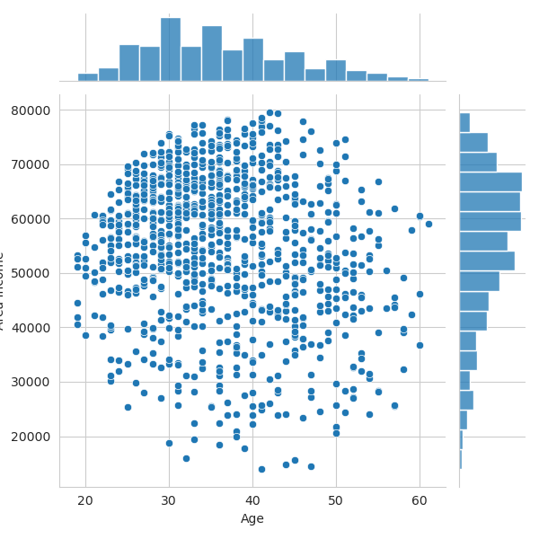

# Logistic Regression Project

In this project, our goal is to be able create a model that will predict whether or not a user will click on an advertisement. This model is going to be trained on a fake advertising data set. The data will have the following features: 

- 'Daily Time Spent on Site': consumer time on site in minutes
- 'Age': cutomer age in years
- 'Area Income': Avg. Income of geographical area of consumer
- 'Daily Internet Usage': Avg. minutes a day consumer is on the internet
- 'Ad Topic Line': Headline of the advertisement
- 'City': City of consumer
- 'Male': Whether or not consumer was male
- 'Country': Country of consumer
- 'Timestamp': Time at which consumer clicked on Ad or closed window
- 'Clicked on Ad': 0 or 1 indicated clicking on Ad

## Getting the data

````python
ad_data = pd.read_csv('advertising.csv')
````
### Check the head of the data
````python
printInfo = [
            ad_data.head(),
            ad_data.info(),
            ad_data.describe()
        ]

for item in printInfo:
    print(item, end = '\n')
````

````
<class 'pandas.core.frame.DataFrame'>
RangeIndex: 1000 entries, 0 to 999
Data columns (total 10 columns):
 #   Column                    Non-Null Count  Dtype  
---  ------                    --------------  -----  
 0   Daily Time Spent on Site  1000 non-null   float64
 1   Age                       1000 non-null   int64  
 2   Area Income               1000 non-null   float64
 3   Daily Internet Usage      1000 non-null   float64
 4   Ad Topic Line             1000 non-null   object 
 5   City                      1000 non-null   object 
 6   Male                      1000 non-null   int64  
 7   Country                   1000 non-null   object 
 8   Timestamp                 1000 non-null   object 
 9   Clicked on Ad             1000 non-null   int64  
dtypes: float64(3), int64(3), object(4)

memory usage: 78.3+ KB
   Daily Time Spent on Site  Age  Area Income  Daily Internet Usage                          Ad Topic Line            City  Male     Country            Timestamp  Clicked on Ad
0                     68.95   35     61833.90                256.09     Cloned 5thgeneration orchestration     Wrightburgh     0     Tunisia  2016-03-27 00:53:11              0
1                     80.23   31     68441.85                193.77     Monitored national standardization       West Jodi     1       Nauru  2016-04-04 01:39:02              0
2                     69.47   26     59785.94                236.50       Organic bottom-line service-desk        Davidton     0  San Marino  2016-03-13 20:35:42              0
3                     74.15   29     54806.18                245.89  Triple-buffered reciprocal time-frame  West Terrifurt     1       Italy  2016-01-10 02:31:19              0
4                     68.37   35     73889.99                225.58          Robust logistical utilization    South Manuel     0     Iceland  2016-06-03 03:36:18              0
None

       Daily Time Spent on Site          Age   Area Income  Daily Internet Usage         Male  Clicked on Ad
count               1000.000000  1000.000000   1000.000000           1000.000000  1000.000000     1000.00000
mean                  65.000200    36.009000  55000.000080            180.000100     0.481000        0.50000
std                   15.853615     8.785562  13414.634022             43.902339     0.499889        0.50025
min                   32.600000    19.000000  13996.500000            104.780000     0.000000        0.00000
25%                   51.360000    29.000000  47031.802500            138.830000     0.000000        0.00000
50%                   68.215000    35.000000  57012.300000            183.130000     0.000000        0.50000
75%                   78.547500    42.000000  65470.635000            218.792500     1.000000        1.00000
max                   91.430000    61.000000  79484.800000            269.960000     1.000000        1.00000
````
## Exploratory Data Analysis

### Create a histogram of the Age

````python
sns.histplot(data = ad_data, x = 'Age') 
ad_data['Age'].hist(bins = 30)
plt.xlabel('Age')
````


### Create a jointplot showing Area Income versus Age

````python
sns.jointplot(data = ad_data, x = 'Age', y = 'Area Income')
````



````python
sns.jointplot(data = ad_data,
              x = 'Age',
              y = 'Daily Time Spent on Site',
              kind = 'kde',
              color = 'red')
````


````python
sns.jointplot(
        data = ad_data,
        x = 'Daily Time Spent on Site',
        y = 'Daily Internet Usage',
        color = 'green'
        )
````


Create a pairplot with the hue defined by the 'Clicked on Ad' column feature.

````python
sns.pairplot(
        data = ad_data,
        hue = 'Clicked on Ad'
        )
````


### Logistic Regression

Let's import all the necessary modules for training, testing, and evaluating our model.

````python
from sklearn.model_selection import train_test_split
from sklearn.linear_model import LogisticRegression
from sklearn.metrics import classification_report
````

Now, let's split our data into training set and testing set using `train_test_split`

We can just drop all the columns that are non-numerical. 

````python
X = ad_data[[
        'Daily Time Spent on Site',
        'Age',
        'Area Income',
        'Daily Internet Usage',
        'Male'
    ]]

y = ad_data['Clicked on Ad'] 
````

Then, let's train and fit a logistic regression model on the training set.

````python
X_train, X_test, y_train, y_test = train_test_split(X,y, test_size = 0.3, random_state = 101)
lm = LogisticRegression()
lm.fit(X_train, y_train)
````

Predicting the values for the testing data
````python
predictions = lm.predict(X_test)
````
and classification report
````python
print(
    classfication_report(y_test, predictions)
)
````
which outputs the following results:
````
              precision    recall  f1-score   support

           0       0.91      0.95      0.93       157
           1       0.94      0.90      0.92       143

    accuracy                           0.93       300
   macro avg       0.93      0.93      0.93       300
weighted avg       0.93      0.93      0.93       300
````

If we wanted to see the confusion matrix, then we simply need to type:
````python
from sklearn.metrics import confusion_matrix
print(
    confusion_matrix(y_test, predictions)
)
````
which returns the following matrix:
````
[[149   8]
 [ 14 129]]
````
